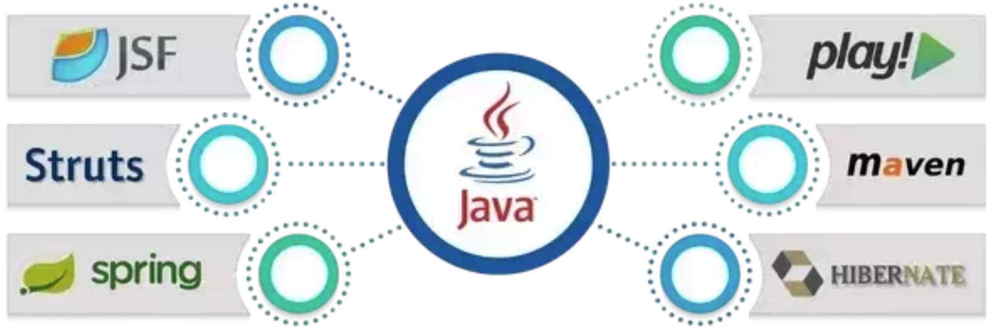
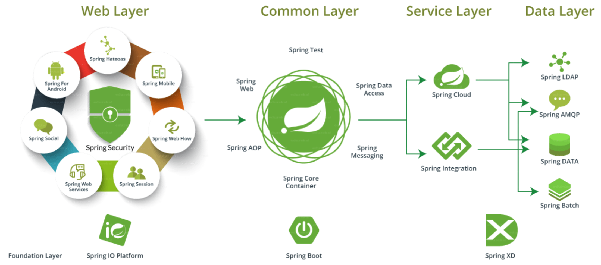

Spring is a powerful, lightweight framework used for application development. and It is built in response to the complexity of developing apps using the java enterprise framework called J2EE now JEE, aim at removing the complexity and help make data access and web development more accessible and reducing boilerplate code which is repetitive code that's often needed as a part of the logic but tends to clutter [disarrange] the app

---

## Introduction :

Before telling you the reason why `Spring Framework` is popular, let us first give you a brief about it.

`Spring` is a powerful, lightweight framework used for application development. and It is built in response to the complexity of developing apps using the java enterprise framework called J2EE now JEE, aim at removing the complexity and help make data access and web development more accessible and reducing boilerplate code which is repetitive code that's often needed as a part of the logic but tends to clutter [disarrange] the app

In a way, it is an **ecosystem** because it provides support to various frameworks such as Struts, Hibernate using `Java` as a programming language.

## Some problems when using JEE standards without framework :

We can developed application using JEE standards and deploy an it on any JEE application server. But, it had several problems, including:

- The code became very complicated as the application progressed.
- The performance of the system got affected due to the heaviness of the applications.
- The look-up problem of the component.

The Spring framework comes to solve all these problems.

## Some frameworks provided by Java:

There are various frameworks provided by Java. Some of which are listed below:

Among all these, Spring Framework is pretty much popular and has successfully ruled the market since the very beginning. Check out the following image, which shows its popularity against other frameworks:

As you can see from the above graph, Spring gives tough competition to the rest of the frameworks.

## Most Important Features of the Spring Framework:

1. **Lightweight:** Spring Framework is lightweight concerning size and transparency.
2. **Simplicity:** Spring Framework is simple because it's non-invasive as it uses POJO and POJI models.
   > - POJO (Plain Old Java Objects): A Java class not coupled with any technology or any framework is called "POJO".
   > - POJI (Plain Old Java Interfaces): A Java interface not coupled with any technology or any framework is called "POJI".
3. **Testability:** For writing the Spring application, the server is not mandatory. But for struts and EJB applications, you need a server, if you want to test the application. It may need a lot of changes in the source, and to view those changes, each time you have to restart the server. This becomes tedious and time-consuming. In the case of Spring Framework, it has it's own container to run the applications.
4. **Loose Coupling:** Spring Framework is loosely coupled because it has concepts like Dependency Injection, AOP, etc. These features help in reducing dependency and increasing the modularity within the code.
5. **Integration With Other Frameworks:** Spring Framework doesn't try to solve the problems that have already been solved. It just tries to integrate them with its framework, which provides a solution to greater problems.

## Some Projects on Spring:

Spring Framework is now the foundation for various other Spring Projects that have come up in the offerings in the last three years ago. Check the below image to find out multiple projects.

## Conclusion 🚀:

Hence, The Spring framework became important in the market due to essential spring framework features.However, It has also a very big community.

Let us know what you think in the comments below and don’t forget to share! 👍🤙
