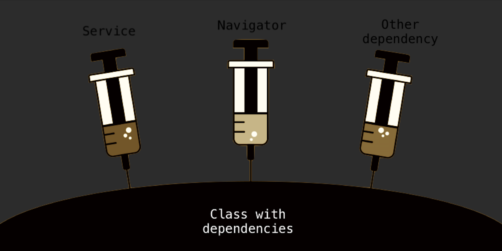

In software engineering, dependency injection` is a technique whereby one object (or static method) supplies the dependencies of another object. A dependency is an object that can be used (a service.

---



## Introduction :

That’s the Wikipedia definition:

> In [software engineering](https://en.wikipedia.org/wiki/Software_engineering), dependency injection` is a technique whereby one object
> (or static method) supplies the dependencies of another object.
> A dependency is an object that can be used (a [service](<https://en.wikipedia.org/wiki/Service_(systems_architecture)>).

But Don’t worry If you don’t understand the definition and it’s not particularly easy to understand.
So let’s understand it better.

Before understanding what it means in programming, let’s first see what it means in general,
as it will help us better understand the concept.

`Dependency` or `dependent` means needing the support of something
or someone to continue existing or operating.
Like if I say we are relying too much on mobile phones than it means we are **dependent** on them.

## What is Dependency Injection:

So before getting to dependency injections,
first let’s understand what a dependency in programming means with a real example.

When software is developed using `OOP`, developers create objects that represent or model real-life things.
Objects don’t exist by themselves.there are usually several objects that make up an application,
and each of those objects may depend on other objects.

For instance, a developer might create a computer object to represent a computer.
That computer object would likely have dependencies on other objects, like hard disk object, or one or more memory objects.
DI is about dealing with the way objects fulfill their dependent objects.

```java
Public class Computer{ //loosely coupled
	HardDisk hdd;
	Memory[] memory;
}
Public class Computer{ //tightly coupled
	String hdd;
	String memory;
}
```

There are mainly two different choices for fulfilling object dependencies:

1. The object fulfills its own dependencies. (`tightly coupled objects`)

2. The object declares what it depends on, and something else fulfills the dependency.
   (more flexible and `loosely coupled objects`)

So the best choice is `two` .because the choice `one` is **tightly coupled** objects,
and If someone wants to buy a computer where you couldn’t change or upgrade the memory .
when the computer was created ,it created the memory as part of computer then if you wanted to change or upgrade the memory,
you’d have to buy a whole new computer. but choice `two` of declaring our dependencies is much **more flexible**.
The object and its dependencies are **loosely coupled** because you can change one without changing the other.

Choice `two` is what we would call `Dependency Injection`.and spring core is a DI container .
you can utilize it to declare object and their dependencies.
And spring core will create and manage and connect them all together.
Hence this results in less things for a developer to manage and it is the glue of the application.

## Types of Dependency Injection:

- **Constructor injection**: the dependencies are provided through a class constructor.
- **Setter injection**: the client exposes a setter method that the injector uses to inject the dependency.
- **Interface injection**: the dependency provides an injector method that will inject the dependency into any client passed to it.
  Clients must implement an interface that exposes a setter method that accepts the dependency.

## Benefits of using Dependency Injection:

- Helps in Unit testing.
- Boilerplate code is reduced, as initializing of dependencies is done by the injector component.
- Extending the application becomes easier.
- Helps to enable loose coupling, which is important to write clean code and easy to maintain.

## Conclusion:

`Dependency injection` is a powerful, useful, and critical technique to use in order
to write **clean**, **loosely coupled**, **easy to maintain code**.

There are three ways to do dependency injection, each having its own use case.
Learn when to use these three techniques, and you will be well on your way to writing excellent, testable, and lovely code.

In the future blog, we will explain the concept of `Inversion of control` behind DI in Spring
and give more detail about types of DI with some examples.

Let us know what you think in the comments below and don’t forget to share! 👍🤙
