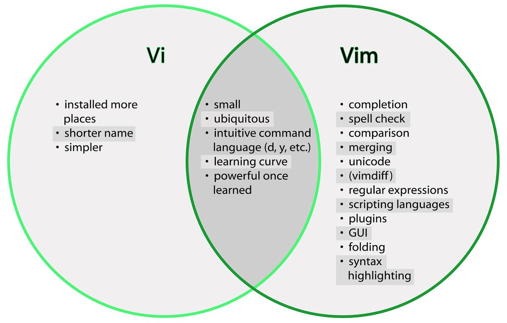
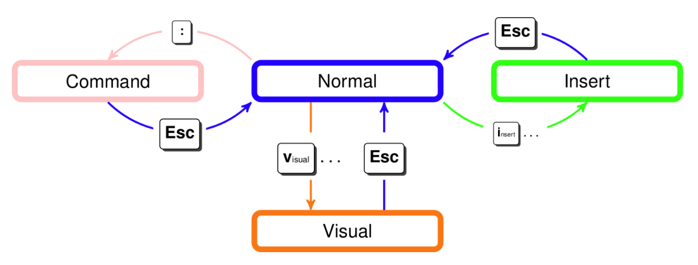

Writing English words and writing code are very different activities. When programming, you spend more time switching files, reading, navigating, and editing code compared to writing a long stream. It makes sense that there are different types of programs for writing English words versus code.

---

## Introduction

Writing English words and writing code are very different activities.
When programming, you spend more time switching files, reading, navigating, and editing code compared to writing a long stream.
It makes sense that there are different types of programs for writing English words versus code.

## How to learn new Editor?

As programmers, we spend most of our time editing code, so it’s worth investing time mastering an editor that fits your needs.
Here’s how you learn a new editor:

- Start with a tutorial
- Stick with using the editor for all your text editing needs
- Look things up as you go: if it seems like there should be a better way to do something, there probably is

If you follow the above method, fully committing to using the new program for all text editing purposes,
the timeline for learning a sophisticated text editor looks like this.
In an hour or two, you’ll learn basic editor functions such as opening and editing files, save/quit, and navigating buffers.
Once you’re 30 hours in, you should be as fast as you were with your old editor.
After that, the benefits start: you will have enough knowledge and muscle memory that using the new editor saves you time.
Modern text editors are fancy and powerful tools, so the learning never stops: you’ll get even faster as you learn more.

## Why Vim is most popular CLI Editor?

When programming, you spend most of your time reading/editing, not writing.
For this reason, Vim is the most popular command-line-based editor and it is a modal editor: it has different modes for inserting text vs manipulating text.
Vim avoids the use of the mouse because it’s too slow.

Vim is a really good tool once you familiarize yourself with it. And It also helps you focus on the coding process itself,
you won't be using the mouse at all to deal with it, that'll save you a lot of time when you're just writing code.

Vim has a wealth of plugins for whatever it is you're doing, as well.

## Difference between Vim and Vi?

vim is almost a proper superset of vi. Therefore, everything that is in vi is available in vim.
Vim adds to those features.

- Support (syntax highlighting, code folding, etc) for several popular programming languages (C/C++, Java, etc.)
- Editing files using network protocols like SSH and HTTP.
- Multilevel undo/redo.
- Allows the screen to be split for editing multiple files.
- Support for plugins, and great control over config and startup files.

## Vim Modes

Vim has multiple operating modes.

- **Normal**: for moving around a file and making edits
- **Insert**: for inserting text
- **Replace**: for replacing text
- **Visual (plain, line, or block)**: for selecting blocks of text
- **Command-line**: for running a command

You change modes by pressing `<ESC>` (the escape key) to switch from any mode back to Normal mode.
From Normal mode, enter Insert mode with `i`, Replace mode with `R`, Visual mode with `v`, Visual Line mode with `V`,
Visual Block mode with `<C-v>` (`Ctrl-V`, sometimes also written `^V`), and Command-line mode with `:` .

## Customizing Vim(.vimrc)

**Vim** is customized through a plain-text configuration file in `~/.vimrc` (containing **Vimscript** commands).
There are probably lots of basic settings that you want to turn on.
We recommend using this basic config because it fixes some of Vim’s quirky default behavior.
Download our config here and save it to `~/.vimrc`.



## Conclusion 🚀 🚀 🚀

Learning `Vim` is a lot of work but can also be a lot of fun.and it is the most popular command-line-based editor.

The end result is an editor that can match the speed at which you think.

Let us know what you think in the comments below and don’t forget to share! 👍🤙

-My personal favorite Vim Cheat Sheet: [👇👇](https://devhints.io/vim)

-My personal favorite Config .vimrc: [👇👇](https://gist.github.com/abdennacerelmaalem/5ca7a19294cb8d63ecd6cef4b9266b9d)
