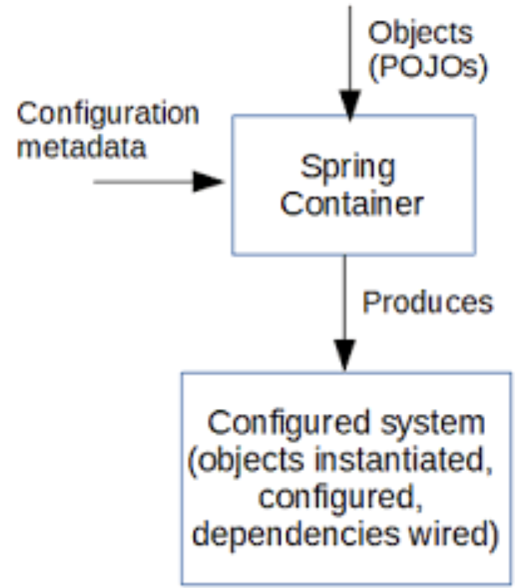

## Introduction :

The IoC Container is at the core of the Spring Framework.In this article, we’re going to learn about IoC Container,
How does it work, How we can do his configuration and what is types of containers that present in the spring framework.

## What is IoC Container

To save you the time spent on searching Wikipedia here is the definition:

> **Inversion of control (`IoC`)** is a programming principle. IoC inverts the flow of control as compared to traditional control flow.
> In `IoC`, custom-written portions of a computer program receive the flow of control from a generic framework.

But Don’t worry If you don’t understand the definition and it’s not particularly easy to understand.
So let’s understand it better.

As the name suggest **Inversion of control** pattern Inverts responsibility of managing the life cycle of the object e.g.
creating an object,wiring the object together, setting their dependency etc from application to a framework,
which makes writing Java application even more easy. The programmer often confused between `IOC` and [`DI`](<https://elmaalem.me/posts/dependency-injection-(di)/>),
well both words used interchangeably in Java world but **Inversion of Control** is a more general concept and [**Dependency Injection**](<https://elmaalem.me/posts/dependency-injection-(di)/>) is a concrete design pattern.

## How to implement IoC Container

In object-oriented programming, there are several basic techniques to implement inversion of control. These are:

- using a factory pattern
- using a service locator pattern
- using a dependency injection of any given below type:
  - a constructor injection
  - a setter injection
  - an interface injection
    > We will talk about these mechanisms in future blogs

## How does the IoC container work

Before understanding how to configure IoC container, let’s first see How does the IoC container work, as it will help us better understand the concept.

The `IoC` container receives metadata from either an **XML file**, **Java annotations**, or **Java code**. `IoC` adds the flexibility and control of application,
and provides a central place of configuration management for **Plain Old Java Objects (POJO)** of our application.
This diagram illustrates an abstract view of the working of Spring Framework.
It shows how Spring makes use of Java `POJO` classes and configuration metadata to produce a fully configured application.


_IoC Container Operation_

## Configuration of the IoC container

There are three different ways to configure Spring Bean.

This my Class `Person`:

```java
package com.elmaalem;

public class Person {

    private String Name;

    public String getName() {
        return name;
    }

    public void setName(String name) {
        this.name = name;
    }
}
```

1. XML file

```xml
<?xml version="1.0" encoding="UTF-8"?>
<beans xmlns="http://www.springframework.org/schema/beans"
       xmlns:xsi="http://www.w3.org/2001/XMLSchema-instance"
       xsi:schemaLocation="http://www.springframework.org/schema/beans http://www.springframework.org/schema/beans/spring-beans.xsd">
    <bean id="Person" class="com.elmaalem.Person">
        <property name="name" value="elmaalem"></property>
    </bean>
```

2. Java-based configuration

If you are using only annotations, you can configure a Spring bean using @Bean annotation.
This annotation is used with @Configuration classes to configure a spring bean.

```java
   package com.elmaalem;

   import org.springframework.context.annotation.Bean;
   import org.springframework.context.annotation.ComponentScan;
   import org.springframework.context.annotation.Configuration;

   @Configuration
   @ComponentScan("com.elmaalem")
   public class Config {
       @Bean("Person")
       public Person getPerson(){
           Person person = new Person();
           person.setName("elmaalem");
           return person;
       }
   }
```

3. JAVA annotations

We can also use @Component, @Service, @Repository and @Controller annotations with classes to configure them to be as spring bean.

```java
package com.elmaalem;

import org.springframework.beans.factory.annotation.Value;
import org.springframework.stereotype.Component;

@Component("Person")
public class Person {
    @Value("elmaalem")
    private String name;

    public String getName() {
        return name;
    }

    public void setName(String name) {
        this.name = name;
    }
}
```

## Types of IoC containers and the difference between them

Spring framework provides two implementations of `IOC` container in the form of `Application Context` and `BeanFactory` which manages the life-cycle of bean used by Java application,
both are Java interfaces and `Application Context` extends `BeanFactory`.

1.  Spring BeanFactory Container:

    It is the simplest container present in the Spring framework which provides the basic support for Dependency Injection.
    We use the following interface to work with this container.
    `org.springframework.beans.factory.BeanFactory`

    You can see the implementation of this interface using the example above:

    ```java
    package com.elmaalem;

    import org.springframework.beans.factory.BeanFactory;
    import org.springframework.beans.factory.xml.XmlBeanFactory;
    import org.springframework.core.io.ClassPathResource;
    import org.springframework.core.io.Resource;

    public class Application {
        public static void main(String[] args) {
            Resource resource = new ClassPathResource("Beans_file.xml");
            BeanFactory factory = new XmlBeanFactory(resource);
            Person person = factory.getBean("person",person.class);
            System.out.println(person.getName());
        }
    }
    ```

2.  Spring ApplicationContext Container:

    This is another container present in the spring container which adds extra enterprise-specific functionality.
    These functionalities include the capability to resolve textual messages from a properties file and publishing application events to the attentive event listeners.
    We use the following interface to work with this container.
    `org.springframework.context.ApplicationContext`

    You can see the implementation of this interface using the example above:

    ```java
          package com.elmaalem;

          import org.springframework.context.ApplicationContext;
          import org.springframework.context.annotation.AnnotationConfigApplicationContext;

          public class Application {
              public static void main(String[] args) {
                  ApplicationContext applicationContext = new AnnotationConfigApplicationContext(Config.class);
                  Person person = applicationContext.getBean("person",person.class);
                  System.out.println(person.getName());
              }
          }
    ```

3.  BeanFactory vs ApplicationContext Container:

    `BeanFactory` provides basic `IOC` and `DI` features while `ApplicationContext` provides advanced features.
    Apart from these, Here are a few more differences between `BeanFactory` and `ApplicationContext` which is mostly based upon features supported by them.

    - **BeanFactory** instantiate bean when you call **getBean()** method while **ApplicationContext** instantiate Singleton bean when container is started, It doesn't wait for **getBean()** to be called.
    - One of the popular implementation of **BeanFactory** interface is **XMLBeanFactory** while one of the popular implementation of **ApplicationContext** interface is **ClassPathXmlApplicationContext**.
    - **BeanFactory** by default its support Lazy loading and **ApplicationContext** by default support Aggresive loading.

      > **Lazy loading**: When the container creates and configures all **singleton** beans during initialization(By default).

In fact, `ApplicationContext` container is often preferred over `BeanFactory` container.

## Conclusion 🚀 🚀 🚀

In this article, we've presented the concepts of `inversion of control` and exemplified them in the Spring framework.

In general, the `IoC` container lets you inject required objects in the runtime instead of the compile-time by the **dependency injection**,
in order to make java classes independent of each other (**loosely coupling**) and frees them from object creation and maintenance.

Then if you want to understand what is means DI(Dependency Injection) in Spring.
This my blog about it. [👇👇](<https://elmaalem.me/posts/dependency-injection-(di)/>)

If you have questions don’t hesitate to ask me in the comments below and don’t forget to share! 👍🤙.
