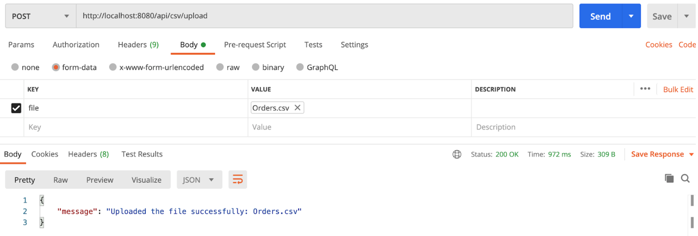
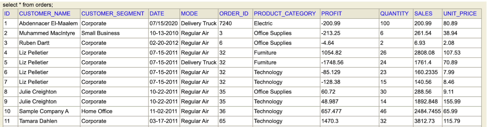
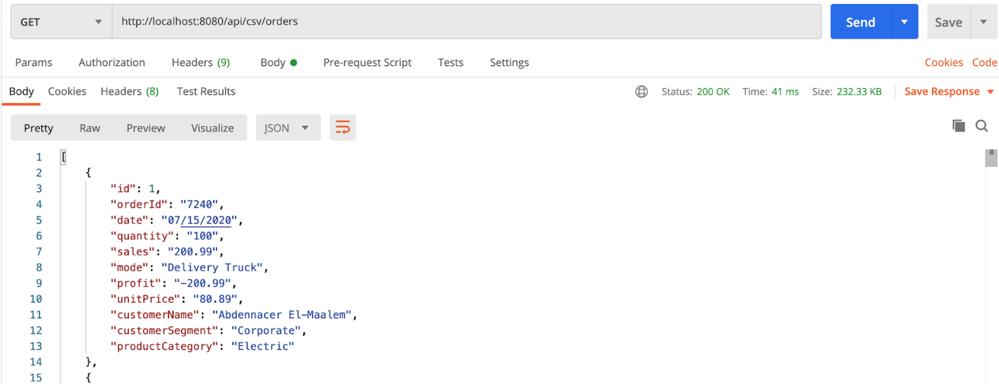
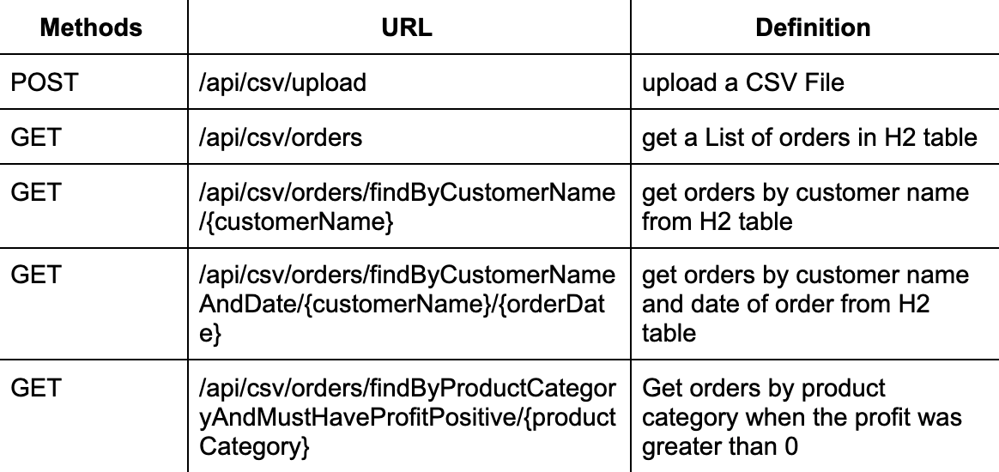
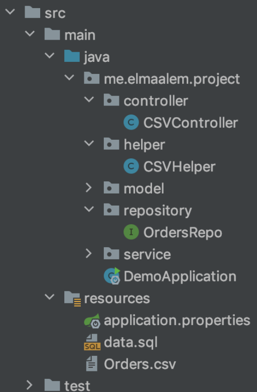
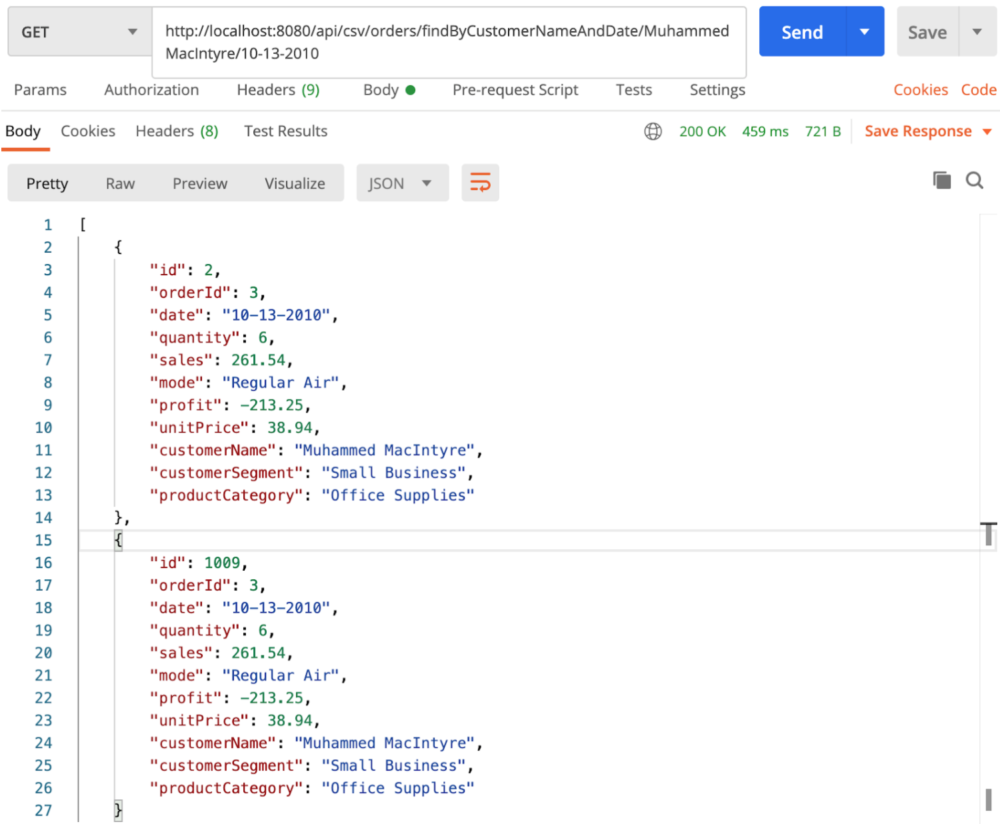

## Introduction

In this tutorial, we are going to create a project which uploads and reads a dataset (CSV file)
into a database and analyze queries given by the user and return results.

Link of dataset Orders : [source](https://www.wisdomaxis.com/technology/software/data/for-reports/Orders-With%20Nulls.xlsx)

#### Technologies:

- Java 8
- Spring Boot (with Spring Web MVC, Spring Data JPA)
- Maven
- Apache Commons CSV
- H2 Database

### Spring Boot Rest APIs for uploading CSV Files:

As we know, we have a `csv` file that contains **Orders** data as following:

```csv
Order ID,Order Date,Order Quantity,Sales,Ship Mode,Profit,Unit Price,Customer Name,Customer Segment,Product Category

3,10-13-2010,6,261.54,Regular Air,-213.25,38.94,Muhammed MacIntyre,Small Business,Office Supplies
6,02-20-2012,2,6.93,Regular Air,-4.64,2.08,Ruben Dartt,Corporate,Office Supplies
32,07-15-2011,26,2808.08,Regular Air,1054.82,107.53,Liz Pelletier,Corporate,Furniture
32,07-15-2011,24,1761.4,Delivery Truck,-1748.56,70.89,Liz Pelletier,Corporate,Furniture
32,07-15-2011,23,160.2335,Regular Air,-85.129,7.99,Liz Pelletier,Corporate,Technology
...
```

We’re going create a Spring Boot Application that provides APIs for:

> - Uploading CSV File and storing data in H2 Database
> - Getting a list of orders from H2 table
> - Getting Orders By Customer Name from H2 table
> - Getting Orders By Customer Name and Order Date from H2 table

After the CSV file uploaded successfully in `Postman`:



Orders table in `H2 database` will look like this:



If we get a list of Orders, the `Spring Rest-API` will return:



These are APIs to be exported:



##### Project Structure:



### Setup Spring Boot CSV File Upload project:

In the first step, we use [spring initializr](https://start.spring.io/) to generate the first configuration of the project:

Use this link to get this configuration: [here](https://start.spring.io/#!type=maven-project&language=java&platformVersion=2.4.0.RELEASE&packaging=jar&jvmVersion=1.8&groupId=com.example&artifactId=demo&name=demo&description=Demo%20project%20for%20Spring%20Boot&packageName=com.example.demo&dependencies=h2,data-jpa,lombok)

Finally, we get the configuration in the file `pom.xml`.

### Configure Spring Datasource, JPA, Hibernate:

Under `src/main/resources` folder, open `application.properties` and add this code:

```properties
spring.datasource.url= jdbc:h2:mem:testdb
spring.datasource.driverClassName=org.h2.Driver
spring.h2.console.enabled=true
spring.datasource.username= sa
spring.datasource.password=

spring.jpa.properties.hibernate.dialect= org.hibernate.dialect.H2Dialect

# Hibernate ddl auto (create, create-drop, validate, update)
spring.jpa.hibernate.ddl-auto= update
```

### Define Data Model:

In the **model package**, we define Orders class.
`model/Orders.class`:

```java
@Data
@AllArgsConstructor
@NoArgsConstructor
@Entity
public class Orders {
    @Id
    @GeneratedValue(strategy = GenerationType.IDENTITY)
    private long id;
    private String orderId;
    private String date;
    private String quantity;
    private String sales;
    private String mode;
    private String profit;
    private String unitPrice;
    private String customerName;
    private String customerSegment;
    private String productCategory;
}
```

### Create a Data Repository for working with Database:

Let’s create a repository to interact with Orders from the database.
In the repository package, create an **`OrdersRepo` interface** that extends `JpaRepository`.

`repository/OrdersRepo.java`:

```java
@Repository
public interface OrdersRepo extends JpaRepository<Orders,Long> {
}

```

### Implement Read/Write CSV Helper Class:

Under **helper package**, we create `CSVHelper` class with 3 methods:

- **hasCSVFormat()**: check if a file has CSV format or not
- **csvToOrders()**: read InputStream of a file, return a list of Orders

We’re gonna use _Apache Commons CSV_ classes such as: _CSVParser_, _CSVRecord_, _CSVFormat_.
Here is the class `helper/CSVHelper.java`:

```java
@Component
public class CSVHelper {
    public static String TYPE = "text/csv";
    static String[] HEADERs = { "Order ID","Order Date","Order Quantity","Sales","Ship Mode","Profit","Unit Price","Customer Name","Customer Segment","Product Category" };

    public static boolean hasCSVFormat(MultipartFile file) {
        if (!TYPE.equals(file.getContentType())) { return false;}
        return true;
    }
    public static List<Orders> csvToOrders(InputStream is) {
        try (BufferedReader fileReader = new BufferedReader(new InputStreamReader(is, "UTF-8"));
             CSVParser csvParser = new CSVParser(fileReader,
             CSVFormat.DEFAULT.withFirstRecordAsHeader().withIgnoreHeaderCase().withTrim());){

                    List<Orders> orders = new ArrayList<Orders>();
                    Iterable<CSVRecord> csvRecords = csvParser.getRecords();
                    for (CSVRecord csvRecord : csvRecords) {
                        Orders order = new Orders(
                                Long.parseLong(csvRecord.get(0)),
                                csvRecord.get(1),
                                Integer.parseInt(csvRecord.get(2)),
                                Double.parseDouble( !csvRecord.get(3).isEmpty() ? csvRecord.get(3) : "0.00"),
                                csvRecord.get(4),
                                Double.parseDouble( !csvRecord.get(5).isEmpty() ? csvRecord.get(5) : "0.00"),
                                Double.parseDouble( !csvRecord.get(6).isEmpty() ? csvRecord.get(6) : "0.00"),
                                csvRecord.get(7),
                                csvRecord.get(8),
                                csvRecord.get(9)
                        );
                        orders.add(order);}
                    return orders;
        }catch (IOException e) {
            throw new RuntimeException("fail to parse CSV file: " + e.getMessage());
        }}}
```

### Create CSV File Service:

`CSVService` class uses `CSVHelper` and `OrdersRepository` for 4 functions:

1. **save(MultipartFile file)**: store CSV data to database
2. **getAllOrders()**: read data from database and return List<Orders>
3. **getOrdersByCustomerName(String customerName)**: select orders which contain the string of customer name and return List<Orders>.
4. **getOrdersByCustomerNameAndDate(String name,String date)**

Here is the code of `service/CSVService.java`:

```java
@Service
public class CSVService {
    @Autowired
    OrdersRepo repository;
    public void save(MultipartFile file) {
        try {
            List<Orders> orders = CSVHelper.csvToOrders(file.getInputStream());
            repository.saveAll(orders);
        }catch (IOException e) {
            throw new RuntimeException("fail to store csv data: " + e.getMessage());
        }
    }
    public List<Orders> getAllOrders() {
        return repository.findAll();
    }
  public List<Orders> getOrdersByCustomerName(String customerName){
        return repository.findAll().stream()
                .filter(s->s.getCustomerName().contentEquals(customerName))
                .collect(Collectors.toList());}
    public List<Orders> getOrdersByCustomerNameAndDate(String name,String date) {
        return repository.findAll().stream()
                .filter(s->s.getCustomerName().contentEquals(name))
                .filter(s->s.getDate().contentEquals(date))
                .collect(Collectors.toList());
    }}
```

### Create Controller for Upload CSV Files:

In the **controller package**, we create a `CSVController` class for RestAPIs.

- `@CrossOrigin` is for configuring allowed origins.
- `@Controller` annotation indicates that this is a controller.
- `@GetMapping` and `@PostMapping` annotation is for mapping HTTP GET & POST requests.
- We use `@Autowired` to inject implementation of CSVService bean to local variables.

`controller/CSVController.java`:

```java
@CrossOrigin("http://localhost:8080")
@Controller
@RequestMapping("/api/csv")
public class CSVController {
        @Autowired
        CSVService fileService;
        //Upload dataset Orders.csv;
        @PostMapping("/upload")
        public ResponseEntity<String> uploadFile(@RequestParam("file") MultipartFile file) {
            String message = "";
            if (CSVHelper.hasCSVFormat(file)) {
                fileService.save(file);
                try {
                    fileService.save(file);
                    message = "Uploaded the file successfully: " + file.getOriginalFilename();
                    return ResponseEntity.status(HttpStatus.OK).body( "\" message \": \" "+ message +" \"");
                } catch (Exception e) {
                    message = "Could not upload the file: " + file.getOriginalFilename() + "!";
                    return ResponseEntity.status(HttpStatus.EXPECTATION_FAILED).body("\" message \": \" "+ message +" \"");
                }
            }
            message = "Please upload a csv file!";
            return ResponseEntity.status(HttpStatus.BAD_REQUEST).body("\" message \": \" "+ message +" \"");
        }
        //1-SELECT * FROM Order;
        @GetMapping("/orders")
        public ResponseEntity<List<Orders>> getAllOrders () {
            try {
                List<Orders> orders = fileService.getAllOrders();

                if (orders.isEmpty()) {
                    return new ResponseEntity<>(HttpStatus.NO_CONTENT);
                }

                return new ResponseEntity<List<Orders>>(orders, HttpStatus.OK);
            } catch (Exception e) {
                return new ResponseEntity<>(null, HttpStatus.INTERNAL_SERVER_ERROR);
            }
        }
        //2-Stream :Get Order By Customer Name
        @GetMapping(value = "/orders/findByCustomerName/{customerName}")
        public ResponseEntity<List<Orders>> getOrdersByCustomerName (@PathVariable String customerName) {
            try {
                List<Orders> orders = fileService.getOrdersByCustomerName(customerName);

                if (orders.isEmpty()) {
                    return new ResponseEntity<>(HttpStatus.NO_CONTENT);
                }
                return new ResponseEntity<List<Orders>>(orders, HttpStatus.OK);
            } catch (Exception e) {
                return new ResponseEntity<>(null, HttpStatus.INTERNAL_SERVER_ERROR);
            }
        }
        //3-Stream :Get Order By Customer Name and Order Date
        @GetMapping("/orders/findByCustomerNameAndDate/{name}/{orderDate}")
        public ResponseEntity<List<Orders>> getOrdersByCustomerNameAndDate (@PathVariable String customerName,@PathVariable String orderDate) {
            try {
                List<Orders> orders = fileService.getOrdersByCustomerNameAndDate(customerName,orderDate);

                if (orders.isEmpty()) {
                    return new ResponseEntity<>(HttpStatus.NO_CONTENT);
                }

                return new ResponseEntity<List<Orders>>(orders, HttpStatus.OK);
            } catch (Exception e) {
                return new ResponseEntity<>(null, HttpStatus.INTERNAL_SERVER_ERROR);
            }
         }
}
```

### Run & Check Results:

Let’s use `Postman` to execute some requests.



### Conclusion 🚀 🚀 🚀

Thank you for reading! If you enjoyed it. Please upvote 👍 it and don’t forget to share! 👍🤙

If you want to test the examples above, you will find my Github code link:

[Spring Boot App: Upload & Read CSV file into database](https://github.com/abdennacerelmaalem/Project_Streams_CSV_Orders)

Link of dataset Orders : [source](https://www.wisdomaxis.com/technology/software/data/for-reports/Orders-With%20Nulls.xlsx)
