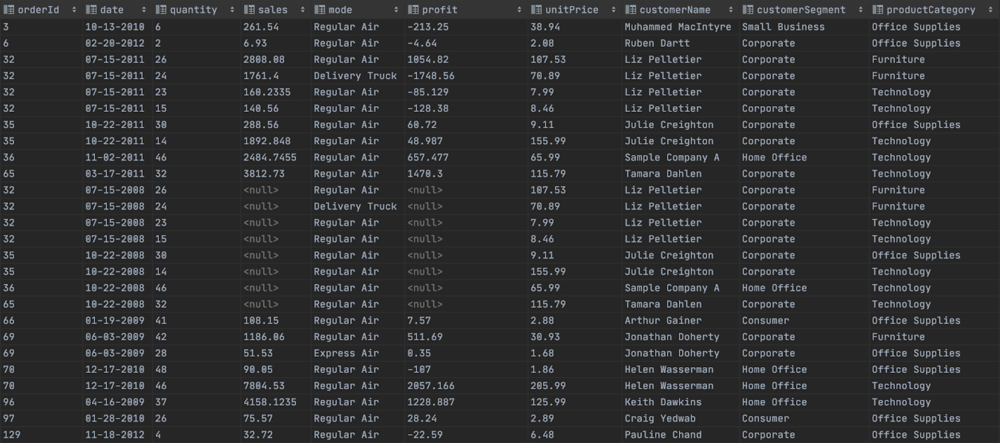
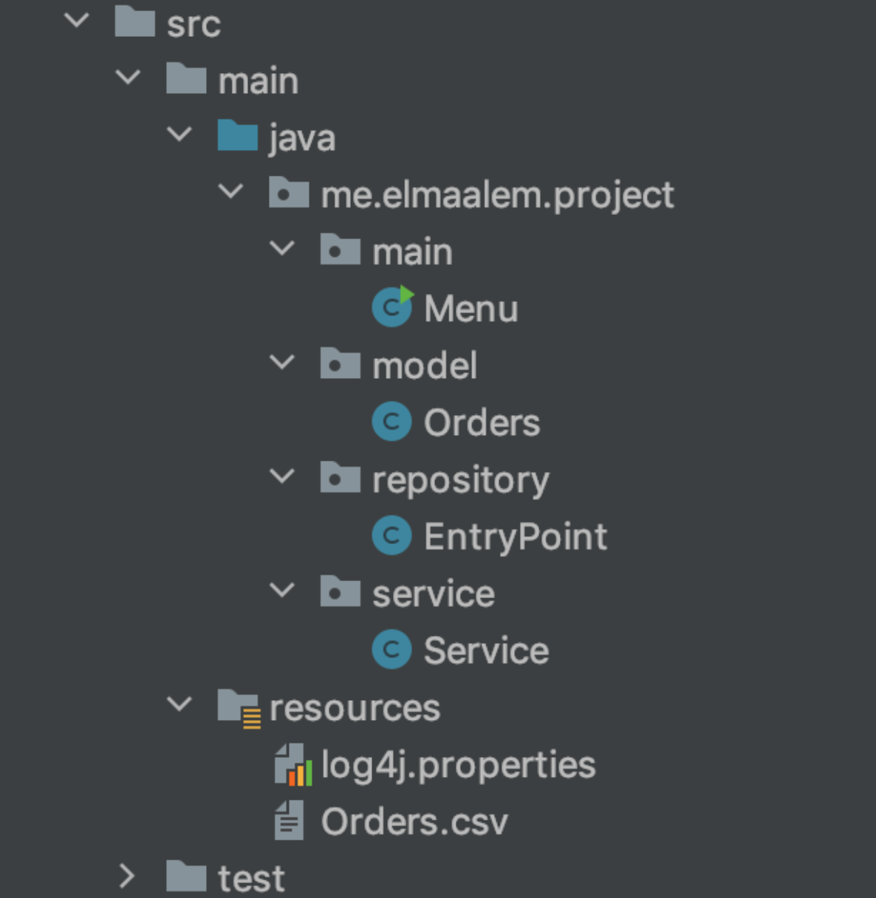
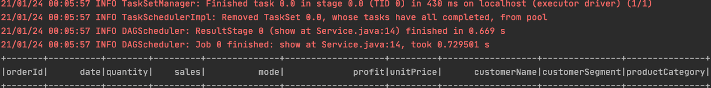
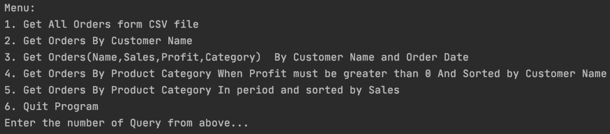
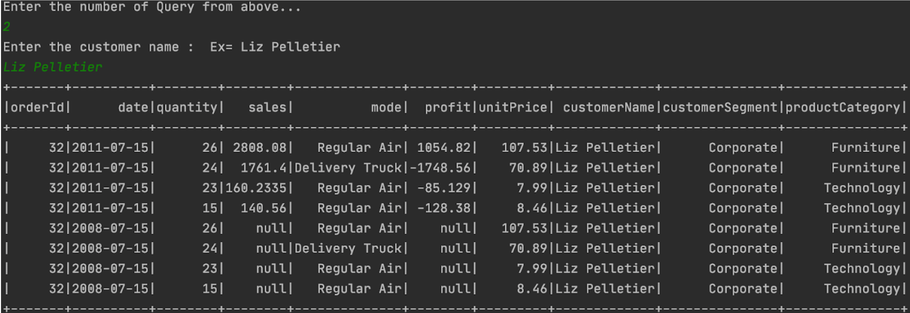

## Introduction

In this tutorial, we are focused to parse data from a CSV file, perform some queries and
output the result in the output using the Spark Core and Spark SQL APIs, Java.

Link of dataset Orders : [source](https://www.wisdomaxis.com/technology/software/data/for-reports/Orders-With%20Nulls.xlsx)

#### Technologies:

- Java 8
- Spark Core 2.4.7
- Spark SQL 2.4.7
- Maven

### Implement some queries using java and spark:

Let’s have a look at **orders** dataset which we will use for these queries:



These are queries to be exported:

> - Get all Orders from csv file
> - Get Orders By Customer Name
> - Get Orders(Name,Sales,Profit,Category) By Customer Name and Order Date
> - Get Orders By Product Category When Profit must be greater than 0 And Sorted by Customer Name
> - Get Orders By Product Category In period and sorted by Sales

##### Project Structure:



### Setup Dependencies on pom.xml:

After Adding the below dependencies on `pom.xml`, It will download all the required packages.

```xml
    <dependencies>
        <!-- Dependency of Apache Spark Core-->
        <dependency>
            <groupId>org.apache.spark</groupId>
            <artifactId>spark-core_2.11</artifactId>
            <version>2.4.7</version>
        </dependency>
        <!-- Dependency of Apache Spark SQL-->
        <dependency>
            <groupId>org.apache.spark</groupId>
            <artifactId>spark-sql_2.11</artifactId>
            <version>2.4.7</version>
        </dependency>
    </dependencies>
```

### Configure Log4j file on spark console:

I'd like to stop various **_INFO messages_** that are coming on the spark console to get just the result on the console without logging messages.



I edit the `log4j.properties` file in order to stop these messages. Here are the contents of `log4j.properties`:

```properties
#Stop INFO messages displaying on Spark console to get just the result expected
log4j.rootCategory=ERROR, console
log4j.appender.console=org.apache.log4j.ConsoleAppender
log4j.appender.console.target=System.err
log4j.appender.console.layout=org.apache.log4j.PatternLayout
log4j.appender.console.layout.ConversionPattern=%d{yy/MM/dd HH:mm:ss} %p %c{1}: %m%n
```

### Define Data Model:

In the **model package**, we define Orders class.
`model/Orders.class`:

```java
public class Orders implements Serializable {
    private int orderId;
    private LocalDate date;
    private int quantity;
    private Optional<Double> sales;
    private String mode;
    private Optional<Double> profit;
    private double unitPrice;
    private String customerName;
    private String customerSegment;
    private String productCategory;
    private static final DateTimeFormatter FORMATTER = DateTimeFormatter.ofPattern("MM-dd-yyyy");
    ...
}
```

### Create a Repository to working with Dataframe(Orders.csv):

Let’s create a repository to interact with **Orders** from the csv file.
In the **repository package**, create a class `EntryPoint` which is responsible for reading CSV file
and loading the data into a spark dataframe with a custom schema.

`repository/EntryPoint.java`:

```java
public class EntryPoint {
   public EntryPoint() { }
   private static SparkSession sparkSession(){
       return SparkSession
               .builder()
               .appName(" Application with Spark SQL and Java")
               .master("local[*]")
               .getOrCreate();
   }
   private static StructType customSchema(){
       return new StructType(new StructField[] {
               new StructField("orderId", DataTypes.IntegerType, true, Metadata.empty()),
               new StructField("date", DataTypes.DateType, true, Metadata.empty()),
               new StructField("quantity", DataTypes.IntegerType, true, Metadata.empty()),
               new StructField("sales", DataTypes.DoubleType, true, Metadata.empty()),
               new StructField("mode", DataTypes.StringType, true, Metadata.empty()),
               new StructField("profit", DataTypes.DoubleType, true, Metadata.empty()),
               new StructField("unitPrice", DataTypes.DoubleType, true, Metadata.empty()),
               new StructField("customerName", DataTypes.StringType, true, Metadata.empty()),
               new StructField("customerSegment", DataTypes.StringType, true, Metadata.empty()),
               new StructField("productCategory", DataTypes.StringType, true, Metadata.empty())
       });
   }
   public static Dataset<Orders> getDataset(){
       Encoder<Orders> orderEncoder = Encoders.bean(Orders.class);
       return sparkSession().read()
               .option("header","true")
               .option("treatEmptyValuesAsNulls", "true")
               .schema(customSchema())
               .option("mode","DROPMALFORMED")
               .option("dateFormat", "MM-dd-yyyy")
               .option("delimiter",",")
               .csv("src/main/resources/Orders.csv")
               .as(orderEncoder);
   }}
```

### Create a Spark Service:

`SparkService` class uses `Repository/EntryPoint` class for 5 functions:

- **listOrders(int numberRows)**: Get all Orders from csv file
- **listOrdersMatchCustomerName(String customerName)**: Get Orders By Customer Name
- **listOrdersMatchCustomerNameAndOrderDate(String customerName, String orderDate)**: Get Orders(Name,Sales,Profit,Category) By Customer Name and Order Date
- **listOrdersMatchCategoryAndProfitPositiveAndSortByCustomerName(String productCategory)**: Get Orders By Product Category When Profit must be greater than 0 And Sorted by Customer Name
- **listOrdersMatchCategoryAndPeriodDateAndSortBySales(String productCategory, String startDate, String endDate)**: Get Orders By Product Category In period and sorted by Sales

Here is the code of `service/SparkService.java`:

```java
public class SparkService {
   public void listOrders(int numberRows){
       getDataset().show(numberRows);
   }
   public void listOrdersMatchCustomerName(String customerName) {
       Dataset<Orders> orders = getDataset().filter((FilterFunction<Orders>) order -> order.getCustomerName().equals(customerName));
       orders.show((int) getDataset().count());
   }
   public void listOrdersMatchCustomerNameAndOrderDate(String customerName, String orderDate) {
       Dataset<Row> orders = getDataset()
               .filter((FilterFunction<Orders>) order -> order.getCustomerName().equals(customerName))
               .select("customerName","date","sales","profit","productCategory")
               .where("date == \"" + orderDate + "\"");
       orders.show((int) getDataset().count());
   }
   public void listOrdersMatchCategoryAndProfitPositiveAndSortByCustomerName(String productCategory) {
       Dataset<Orders> orders = getDataset()
               .filter((FilterFunction<Orders>) order -> order.getProductCategory().equals(productCategory))
               .filter("profit > 0.0")
               .sort("customerName");
       orders.show((int) getDataset().count());
   }
   public void listOrdersMatchCategoryAndPeriodDateAndSortBySales(String productCategory, String startDate, String endDate) {
       Dataset<Row> orders = getDataset()
               .filter((FilterFunction<Orders>) order -> order.getProductCategory().equals("Office Supplies"))
               .sort("sales")
               .where("date < \""+endDate+"\" and date > \""+startDate+"\"")
               .select("customerName","date","sales","quantity","profit","unitPrice","customerSegment");
       orders.show((int) getDataset().count());
   }}
```

### Creating a Menu Driven Program:

Let’s create a `Menu` class under package **Main** to obtain input from a user by displaying a list of options.

`main/Menu.java`:

```java
public class Menu {
    public static Scanner scanner = new Scanner(System.in);
    public static SparkService sparkService = new SparkService();

    public static void main(String[] args) {
        try {
            int menuOption = 0;
            String customerName;
            String productCategory;
            String orderDate;
            String startDate;
            String endDate;

            do {
                // Setting menuOption equal to return value from showMenu();
                menuOption = showMenu();

                switch (menuOption) {...}

            } while (menuOption != 6);

            // Exiting message when user decides to quit Program
            System.out.println("Thanks for using this Program...");

        } catch (Exception ex) {
            System.out.println("Sorry problem occured within Program");
            scanner.next();
        } finally {
            scanner.close();
        }
    }
    public static int showMenu() {
        int option = 0;

        System.out.println("Menu:");
        System.out.println("1. Get All Orders form CSV file ");
        System.out.println("2. Get Orders By Customer Name");
        System.out.println("3. Get Orders(Name,Sales,Profit,Category)  By Customer Name and Order Date");
        System.out.println("4. Get Orders By Product Category When Profit must be greater than 0 And Sorted by Customer Name");
        System.out.println("5. Get Orders By Product Category In period and sorted by Sales");
        System.out.println("6. Quit Program");

        // Getting query number from above menu
        System.out.println("Enter the number of Query from above...");
        option = scanner.nextInt();
        return option;
    }}
```

### Output:

While executing each query , you will be able to see below its content in the console.

- Menu:



- Second Query:



- Fifth Query:


### Conclusion 🚀 🚀 🚀

In this project, we have created a spark application using **Spark Core** and **Spark SQL** with **Java**.
Here, we have loaded the CSV file into **Data Frame** without using any external package.
Also, The CSV format is the common file format which gets used as a source file in most cases.

If you want to test the examples above, you will find my Github code link:

[Spark SQL-Java Application: Read CSV file into Data Frame and Execute some Queries](https://github.com/abdennacerelmaalem/Project_Streams_CSV_Orders)

Link of dataset Orders : [source](https://www.wisdomaxis.com/technology/software/data/for-reports/Orders-With%20Nulls.xlsx)

Thank you for reading! If you enjoyed it. Please upvote 👍 it and don’t forget to share! 👍🤙
